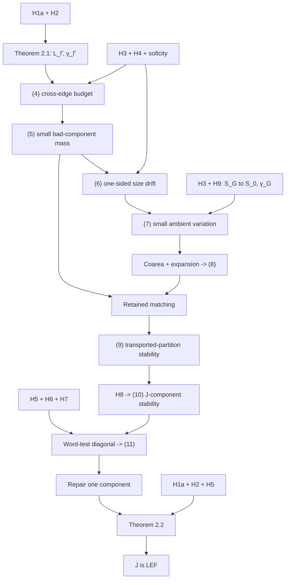

# NSOF-P23-MAP-001A - Proof dependency and error-budget map

**Issue:** [#3 - Reconstruct Proposition 2.3 equation and error-budget ledger](https://github.com/thefourceprinciples/nonsofic-obstruction-lab-/issues/3)

**Status:** `ESTABLISHED` for Proposition 2.3 as stated in the source; `SOURCE-RECONSTRUCTION / HUMAN-REVIEW-PENDING` for this map.

**Claim boundary:** This file reorganizes the proof already given in the cited manuscript. It makes no new theorem claim, does not weaken a hypothesis, and does not assert that any displayed `o(N)` has an effective rate.

## 1. Source lock and locator convention

Source reviewed:

- OpenAI, *Ten Advances in Mathematics and Theoretical Computer Science*, current PDF marked "Updated August 6, 2026".
- PDF: <https://cdn.openai.com/pdf/ten-proofs-oai.pdf>
- Downloaded and checked: 2026-08-10.
- SHA-256: `ebc561ab5c53dbd240e17a8fdb6fffeb648591eca85dbfc7466f563638f8c566`.
- Chapter 3, Proposition 2.3 and proof: printed pages 85-90; PDF file pages 89-94 (one-based).
- External source versions named by the manuscript:
  - [Kun19] G. Kun, *On sofic approximations of property (T) groups*, arXiv:1606.04471v5.
  - [KT19] G. Kun and A. Thom, *Inapproximability of actions and Kazhdan's property (T)*, arXiv:1901.03963v3.

Every source locator below has the form `print p. X / PDF p. Y:L_a-L_b`. The line numbers are one-based lines from

```text
pdftotext -f Y -l Y -layout ten-proofs-oai.pdf page-Y.txt
nl -ba page-Y.txt
```

This convention is mechanical and reproducible. It is not a claim that the PDF itself carries printed line numbers.

## 2. Hypothesis registry

The map uses the following atomic labels so that property (T) of `Γ` never gets conflated with application-only property (T) of `G`.

| ID | Exact hypothesis | First direct use | Last direct use |
|---|---|---|---|
| H1a | `Γ <= G` and `Γ` is infinite | Restrict the `G`-approximation to `Γ` and apply Theorem 2.1 | Prove `|Q_n| -> infinity` and apply Theorem 2.2 with `K = Γ` |
| H1b | `G` is infinite | No independent proof step | Redundant once H1a includes `Γ <= G` and `Γ` infinite |
| H2 | `Γ` has property (T) | Choose finite `S_Γ`; invoke Theorem 2.1 | Invoke Theorem 2.2 with `K = Γ` |
| H3 | `G = <Γ,t_1,...,t_m>` with `m >= 1` | Build the finite generating set `S_G` | Represent every `r in S_0` by a fixed `S_G`-word in the transfer to (7) |
| H4 | `t_i Γ t_i^-1 <= Γ` for every `1 <= i <= m` | Replace each transported conjugate label by a fixed `Γ`-word in (4) | Obtain one-sided variation control for every positive compressing generator before (7) |
| H5 | `J <= G` is finitely generated | Choose finite `T_J` | Invoke Theorem 2.2 |
| H6 | `[Γ,J] = 1` | Identify the multiplication image as a commuting product | Make the repaired model a model of `Γ x J` |
| H7 | `Γ intersect J = {1}` | Make the multiplication map `Γ x J -> G` injective | Transfer distinctness tests from the `G`-approximation to `Γ x J` |
| H8 | `t_1 J t_1^-1 <= Γ` | Choose the `Γ`-word `w_j` in Step 3 | Derive (10) for every chosen `J`-generator |
| H9 | There is a sofic approximation of `G` whose `S_0`-generator graphs are `o(N)` edge edits from uniformly bounded-degree expanders with a uniform constant `γ_G > 0` | Normalize labels and define `L_G` | Use `γ_G` in coarea concentration and the sofic errors in every fixed word test |
| A1 | `G` has property (T) in the concrete application | Not used in Proposition 2.3 | Upstream machinery used only to obtain H9 |

Two exact consequences are used repeatedly:

```text
H4 for i = 1 plus H8:
t_1 (ΓJ) t_1^-1 <= Γ.

H6 plus H7:
the multiplication map Γ x J -> G is an injective homomorphism with image ΓJ.
```

## 3. Fixed notation and the budget ledger

Let `N = N_n = |Y_n|`. All quantities below depend on `n`, even when the subscript is suppressed.

| Symbol | Meaning | Source of control |
|---|---|---|
| `g_n` | `|E(X^G_{S_0,n}) Delta E(L^G_n)|` | H9; `g_n = o(N)` |
| `k_n` | `|E(X^Γ_{S_Γ,n}) Delta E(L^Γ_n)|` | Theorem 2.1 from H1a and H2; `k_n = o(N)` |
| `a_n(F)` | vertices affected by inverse/involution normalization and all multiplicativity/equality/distinctness comparisons in a fixed finite test set `F` | Soficity in H9; `a_n(F) = o(N)` for fixed `F` |
| `x_n(w)` | vertices at which a fixed `Γ`-word `p_w` crosses between components of `L_Γ` | `k_n` plus fixed-word sofic errors; `x_n(w) = o(N)` |
| `b_{i,n}` | `I_i`-edges joining different original components | Output (4) |
| `u_{i,n}` | total unmatched mass `sum_{P in P_i} L(P)` | Expansion of each transported `γ_Γ`-component |
| `v_{i,n}` | total size of components with `L(P) > η_n |P|` | Output (5) |
| `d_{i,n}` | exceptional vertices in the component-size drift inequality (6) | At most `v_{i,n} + u_{i,n}` |
| `V_n(s)` | `sum_z |f(p_s z)-f(z)|` | One-sided drift plus permutation conservation |
| `A_n` | `sum_{edge in E(L_G)} |f(z)-f(w)|` | Output (7) |
| `D_n` | `sum_z |f(z)-1/2|` | Coarea and `γ_G D_n <= A_n` |
| `E_n` | median-exceptional set `{z: |f(z)-1/2| > δ_n}` | `|E_n| <= D_n/δ_n = o(N)` |
| `h_n` | vertices outside the matched intersections in Step 3 | (5), (8), and retained-component bookkeeping |
| `C_n` | vertices at which at least one generator in finite `T` exits its original component | (10), `Γ`-crossing bounds, and a finite union |
| `Delta_n` | vertices incident to `E(X^Γ_{S_Γ,n}) Delta E(L^Γ_n)` | `|Delta_n| <= 2k_n = o(N)` |
| `F_{n,l}` | failures of equality or distinctness among formal `T`-words of length at most `l` | Soficity; `|F_{n,l}| = o(N)` for fixed `l` |
| `B_{n,l}` | `Delta_n`, `F_{n,l}`, and all length-`l` pullbacks of `C_n` | Fixed-`l` union bound |
| `l_n` | diagonal word radius tending to infinity slowly | Chosen so `|B_{n,l_n}|/N -> 0` |
| `e_n` | `|B_{n,l_n}|/N` | Input to (11) and the final repair; `e_n -> 0` |

Uniform constants are:

```text
γ_Γ > 0       component expansion from Theorem 2.1;
γ_G > 0       ambient expansion from H9;
D_Γ, D_G      uniform graph-degree bounds;
m, |S_Γ|,
|S_G|, |S_0|,
|T|           fixed finite cardinalities;
len(w)        fixed word lengths whenever a word is fixed before n -> infinity.
```

No constant above depends on `n`. The diagonal choices `η_n`, `δ_n`, and `l_n` deliberately discard effective rates.

## 4. Proof-dependency graph



## 5. Numbered-estimate map

| ID | Source | Exact output | Direct dependencies | Type and loss |
|---|---|---|---|---|
| (4) | print p. 86 / PDF p. 90:L4-L11 | `b_{i,n} = o(N)` for every fixed `i` | H1a, H2, H4, H9; Theorem 2.1; fixed-word soficity | Asymptotic and lossy: edge edits and word-comparison failures are merged |
| (5) | print p. 86 / PDF p. 90:L12-L25 | `v_{i,n} = sum_{L(P)>η_n|P|}|P| = o(N)` simultaneously in finite `i` | (4), `γ_Γ > 0`, finite `m` | Asymptotic and lossy: Markov truncation and slow diagonal `η_n` erase rate |
| (6) | print p. 86 / PDF p. 90:L29-L37 | `M(τ_i z) >= (1-η_n)M(z)` outside `o(N)` vertices | (5), definition of `L(P)` | Pointwise exact off an asymptotically discarded set; one-sided |
| (7) | print p. 87 / PDF p. 91:L1-L22 | `A_n = sum_{E(L_G)}|f(z)-f(w)| = o(N)` | (6), H3, H4, H9, permutation conservation, fixed-word telescoping, `g_n=o(N)` | Asymptotic and lossy: finite word and edge-edit budgets are summed |
| (8) | print p. 87 / PDF p. 91:L23-L56 | outside `E_n`, `rho_n^-1 <= M(w)/M(z) <= rho_n`, with `rho_n=((1+2δ_n)/(1-2δ_n))^2 -> 1` | (7), coarea identity, H9 through `γ_G`, median normalization | Exact ratio bound off `E_n`; slow `δ_n` loses rate |
| (9) | print p. 88 / PDF p. 92:L25-L30 | a fixed `Γ`-word crosses the first transported partition on `o(N)` vertices | (5), (8), strict-majority injectivity, fixed-word crossing of original components | Asymptotic union bound |
| (10) | print p. 88 / PDF p. 92:L31-L43 | `#{z: C(q_j z) != C(z)} = o(N)` for fixed `j`, where `q_j=τ^-1 p_{w_j}τ` | (9), H8; `τ` is a permutation | Exact conjugation transfer of (9) to `q_j`; `q_j=p_j` only outside a separate `o(N)` set |
| (11) | print p. 89 / PDF p. 93:L21-L39 | choose `Q_n` with `|Q_n intersect B_n| <= e_n|Q_n|` | (10), H5-H7, fixed-word soficity, diagonal `l_n`, weighted averaging | Exact averaging once `B_n` is defined; rate already lost in diagonalization |

The final unnumbered estimate is equally load-bearing:

```text
|E(I_0) Delta E(L_Γ[Q_n])| = O_{|S_Γ|}(e_n |Q_n|) = o(|Q_n|).
```

Source: print p. 90 / PDF p. 94:L1-L8. It is the interface into Theorem 2.2.

## 6. Step-by-step error transfer

### S0. Normalize the approximation and lock the two graph budgets

Source: print p. 85 / PDF p. 89:L32-L48.

Inputs:

- H2 supplies a finite generating set `S_Γ` for the countable property-(T) group `Γ`.
- H3 makes `S_G = S_Γ union {t_i^+-1}` a finite generating set for `G`.
- H9 supplies `S_0`, the sofic maps `p_n`, `L_G`, a uniform degree bound, `γ_G > 0`, and `g_n=o(N)`.
- Fixed inverse and involution relations in the sofic model permit normalization on `o(N)` values.

Output:

```text
N -> infinity;
all inverse labels are exact inverses;
all involutive labels are exact involutions;
g_n plus the normalization edit budget is still o(N).
```

Here `N -> infinity` is forced by H1a and sofic freeness: an infinite `Γ` supplies arbitrarily large finite sets of distinct elements, whose approximating permutations must be pairwise distinct for large `n`; a bounded carrier could not contain them. No disjoint-copy argument is used for the ambient expanders, since a disjoint union would destroy single-graph expansion.

### S1. Apply Kun decomposition

Source: print p. 85 / PDF p. 89:L50-L53 and print p. 86 / PDF p. 90:L1-L3.

External input:

```text
Theorem 2.1 (Kun expander decomposition)
  K = Γ is infinite                 [H1a]
  Γ has property (T)               [H2]
  S_Γ is finite, symmetric, has 1  [H2 and setup]
  p_n restricted to Γ is sofic     [H1a and H9]
  N -> infinity                    [setup]
```

Output:

```text
|E(X^Γ_{S_Γ,n}) Delta E(L_Γ)| = k_n = o(N);
every component Q of L_Γ is a γ_Γ-expander;
γ_Γ > 0 is uniform in n and Q.
```

For a fixed `Γ`-word `w`, crossing between original components is bounded by the finite union of:

```text
generator-edge endpoints incident to the Kun edit set;
fixed-word multiplicativity failures.
```

Hence `x_n(w)=o(N)`. Word length must remain fixed at this stage.

### S2. Derive (4): transported cross-edges

Source: print p. 86 / PDF p. 90:L4-L11.

For `τ_i=p_{t_i}`, transport `L_Γ` to `I_i=τ_i L_Γ`. For every `s in S_Γ`, H4 supplies a fixed `Γ`-word `w_{i,s}` representing `t_i s t_i^-1`. Therefore, up to a constant depending only on the fixed label and multigraph conventions,

```text
b_{i,n}
  <= C_i [
       k_n
       + sum_{s in S_Γ} a_n({τ_i p_s τ_i^-1 = p_{w_{i,s}}})
       + sum_{s in S_Γ} x_n(w_{i,s})
     ]
  = o(N).
```

Hypotheses consumed exactly: H1a and H2 through `L_Γ`; H4 through the existence of each `w_{i,s}`; H9 through approximate multiplicativity. H3 is not needed for a single (4), but it ensures the finite collection of all `t_i` controls the later generating-set transfer.

If H4 fails for a generator used to build `S_G`, the corresponding fixed `Γ`-word does not exist and this cross-edge estimate has no stated replacement.

### S3. Convert cross-edges into unmatched mass and (5)

Source: print p. 86 / PDF p. 90:L12-L25.

For each transported component `P`, expansion and the at-most-double counting of cross-part edges give the exact inequality

```text
γ_Γ L(P)
  <= 2 * #{I_i[P]-edges joining different original components}.
```

Summing over the disjoint `P in P_i` gives

```text
u_{i,n} = sum_P L(P) <= 2b_{i,n}/γ_Γ = o(N).
```

For every `η>0`, the deterministic Markov bound is

```text
v_{i,n}(η)
  = sum_{L(P)>η|P|}|P|
  <= u_{i,n}/η
  <= 2b_{i,n}/(γ_Γ η).
```

Because `m` is fixed and finite, choose a single `η_n downarrow 0` slowly enough that

```text
max_i b_{i,n}/(η_n N) -> 0.
```

This is exactly the diagonal step behind (5). It is lossy because it records no modulus for `η_n`.

### S4. Derive the one-sided size drift (6)

Source: print p. 86 / PDF p. 90:L29-L37.

On a good component and at a matched point,

```text
M(τ_i z) = |Q(P)| >= (1-η_n)|P| = (1-η_n)M(z).
```

A valid explicit exceptional-set budget is

```text
d_{i,n} <= v_{i,n} + u_{i,n} = o(N),
```

where the first term discards bad components and the second discards unmatched points in the remaining components. This proves (6).

For `s in S_Γ`, the separate estimate `M(p_s z)=M(z)` fails only at the `o(N)` original-component crossing set. It uses the Kun edit budget, not H4.

### S5. Bounded median normalization and permutation conservation

Source: print p. 86 / PDF p. 90:L38-L52 and print p. 87 / PDF p. 91:L1-L18.

Define

```text
f(z) = M(z)/(M(z)+mu),
```

where `mu` is a vertex-weighted median of `M`. Then `0<f<1`, `1/2` is a median of `f`, and `f` is constant on original components.

The elementary inequality used with (6) is

```text
((1-η)x)/((1-η)x+a) >= x/(x+a)-η.
```

For a positive `S_G`-generator `s`, let `e_{s,n}` be its exceptional-set size. Then

```text
f(p_s z) >= f(z)-η_n outside e_{s,n} vertices,
e_{s,n}=o(N).
```

Because `p_s` is a permutation,

```text
sum_z [f(p_s z)-f(z)] = 0                     [exact]
total decrease <= η_n N + e_{s,n}             [0<f<1]
V_n(s) <= 2(η_n N + e_{s,n}) = o(N).          [increase = decrease]
```

The inverse-label estimate is exact under change of variables: `V_n(s^-1)=V_n(s)` after inverse normalization.

Hypotheses consumed: H4 for compressing generators; the original-component crossing bound for `S_Γ`; the permutation property from H9. No ambient expansion is used yet.

### S6. Transfer variation from `S_G` to `S_0` and prove (7)

Source: print p. 87 / PDF p. 91:L12-L22.

For each fixed `r in S_0`, H3 gives a fixed `S_G`-word `w_r=s_1...s_k`. If `m_{r,n}` counts the points where `p_r` differs from the word permutation, then

```text
sum_z |f(p_r z)-f(z)|
  <= sum_{j=1}^k V_n(s_j) + m_{r,n}
  = o(N).
```

Here `m_{r,n}=o(N)` by the finitely many multiplication comparisons for the fixed word. Summing over fixed finite `S_0` and paying at most one unit of variation per edited edge gives

```text
A_n
  <= C_0 * sum_{r in S_0} V_n(r) + g_n
  = o(N),
```

with a convention-dependent fixed `C_0`. This is (7).

H3 is consumed precisely here: without a fixed `S_G`-word for every ambient-expander generator, small variation along `S_G` does not transfer to `L_G`.

### S7. Coarea concentration and (8)

Source: print p. 87 / PDF p. 91:L23-L56.

The finite coarea identity is exact:

```text
integral_0^1 |boundary_{L_G}{f>t}| dt
  = sum_{edges {z,w} in L_G} |f(z)-f(w)|
  = A_n.
```

The median property makes the relevant sublevel or superlevel set have at most `N/2` vertices. Applying the ambient expansion assumption yields

```text
γ_G D_n <= A_n,
D_n = sum_z |f(z)-1/2| = o(N).
```

Choose `δ_n downarrow 0` slowly enough that `D_n/(δ_n N)->0`. Markov's inequality gives

```text
|E_n| <= D_n/δ_n = o(N).
```

For `z,w notin E_n`, the identity `M=mu*f/(1-f)` gives the exact ratio in (8):

```text
rho_n^-1 <= M(w)/M(z) <= rho_n,
rho_n = ((1+2δ_n)/(1-2δ_n))^2 -> 1.
```

This is the only place in Steps 1-3 where the ambient expansion constant `γ_G` is consumed. Property (T) of `G` is not consumed.

### S8. Retained-component and near-bijection budget

Source: print p. 88 / PDF p. 92:L1-L24.

Let `R_n` be the total size of nonretained transported components for `i=1`. The three rejection tests give

```text
R_n
  <= v_{1,n}
     + |E_n|
     + |E_n|/(1-η_n)
  = o(N).
```

For a retained `P`, (8) and `L(P)<=η_n|P|` give

```text
rho_n^-1 |P| <= |Q(P)| <= rho_n |P|,
|P Delta Q(P)| <= (rho_n-1+2η_n)|P| = o(|P|).
```

Eventually `2(1-η_n)>rho_n`, so `P intersect Q(P)` is a strict majority of `Q(P)`. Disjoint transported components cannot be strict majorities of the same original component. Thus `P -> Q(P)` is injective on retained components.

If `H_n` is the union of matched intersections, then one explicit global budget is

```text
h_n = |Y_n setminus H_n|
  <= R_n + η_n N
  = o(N).
```

The strict-majority argument is exact once its eventual numerical inequality holds.

### S9. Derive (9)

Source: print p. 88 / PDF p. 92:L25-L30.

For a fixed `Γ`-word `w`, discard:

```text
Y_n setminus H_n;                         size h_n
p_w^-1(Y_n setminus H_n);                 size h_n because p_w is a permutation
the original-component crossing set;     size x_n(w).
```

On the complement, injectivity of the retained matching forces `z` and `p_w z` into the same transported component. Therefore the left side of (9) is bounded by

```text
2h_n + x_n(w) = o(N).
```

The word remains fixed; this estimate is not yet uniform over growing word balls.

### S10. Derive (10) and keep `q_j` distinct from `p_j`

Source: print p. 88 / PDF p. 92:L31-L43.

H8 supplies a fixed `Γ`-word `w_j` representing `t_1 j t_1^-1`. Define

```text
q_j = τ^-1 p_{w_j} τ,  τ=p_{t_1}.
```

Conjugation by the permutation `τ` gives an exact correspondence:

```text
C(q_j z) != C(z)
iff
τz and p_{w_j}τz lie in different first-transport components.
```

Hence (9) gives (10) with the same cardinality budget after a bijective change of variables.

Separately,

```text
#{z:q_j z != p_j z}=o(N)
```

by fixed-word approximate multiplicativity. This agreement is needed for later sofic word tests, but it is not part of the component-exit count in (10). Conflating `q_j` with `p_j` would hide one error transfer.

### S11. Fixed word tests, the diagonal, and (11)

Source: print p. 88 / PDF p. 92:L45-L53 and print p. 89 / PDF p. 93:L1-L39.

H5 supplies a finite symmetric `T_J`; set `T=S_Γ union T_J`. After an additional `o(N)` inverse/involution normalization, (10) and the `Γ`-crossing estimates imply

```text
|C_n| = o(N).
```

H6 and H7 identify `Γ x J` with a subgroup of `G`, so equality and distinctness of formal words are genuine equality and distinctness tests in the original sofic approximation.

For fixed `l`, permutations preserve cardinality, so the definition of `B_{n,l}` gives the explicit union bound

```text
|B_{n,l}|
  <= |Delta_n|
     + |F_{n,l}|
     + |W_{l-1}| |C_n|
  = o(N).
```

The number of word pairs in `F_{n,l}` is finite for fixed `l` and at most `|W_l|^2` per equality/distinctness family. This finiteness is why H5 is consumed before diagonalization.

Choose `l_n -> infinity` slowly enough that

```text
e_n = |B_{n,l_n}|/N -> 0.
```

Because the original components partition `Y_n`,

```text
sum_{Q in Q} |Q intersect B_n| = |B_n| = e_n N,
sum_{Q in Q} |Q| = N.
```

Weighted averaging therefore yields (11) exactly:

```text
some Q_n satisfies |Q_n intersect B_n|/|Q_n| <= e_n.
```

At a point outside `B_n`, the word-metric ball of radius `floor(l_n/2)` in `Γ` injects into `Q_n`. H1a (`Γ` infinite) then forces `|Q_n|->infinity`. This is the second direct use of infinitude, after Theorem 2.1.

### S12. Repair and invoke Theorem 2.2

Source: print p. 89 / PDF p. 93:L41-L54 and print p. 90 / PDF p. 94:L1-L8.

For `P=Q_n` and a generator `t`, restrict `q_t` to internal arcs. The missing domain has size

```text
|P setminus A_t|
  <= |C_n intersect P|
  <= |B_n intersect P|
  <= e_n|P|.
```

Completing the partial bijection therefore changes at most `e_n|P|` values per chosen generator, and at most `O_T(e_n|P|)` values over the fixed finite label set. All word tests of length at most `l_n` starting outside `B_n` are unchanged, so the repaired maps form a sofic approximation of `Γ x J` on `Q_n`.

For the repaired `S_Γ`-generator graph `I_0`, the manuscript obtains

```text
|E(I_0) Delta E(L_Γ[P])|
  = O_{|S_Γ|}(e_n|P|)
  = o(|P|).
```

The external theorem interface is now exact:

```text
Theorem 2.2 (Kun-Thom expander-centralizer theorem)
  K = Γ is infinite                         [H1a]
  K has property (T)                        [H2]
  J is finitely generated                    [H5]
  Γ x J has a sofic approximation on Q_n    [S11-S12]
  |Q_n| -> infinity                         [H1a and (11)]
  Γ-generator graph is o(|Q_n|) edits
    from one γ_Γ-expander                    [S12]
```

Theorem 2.2 then gives `J` is LEF. Its near-expander variant is itself reduced in the manuscript to [KT19, Theorem 1.1] by adding the missing edges in at most `2D-1` matchings, with `D` the uniform degree bound. The repair costs `O(1)` permutation values per missing edge, hence `o(|Q_n|)` in total.

## 7. Hypothesis-ablation map

"Failure" below means that this proof route loses a justified step. It does not assert that the proposition's conclusion becomes false.

| Hypothesis weakened or removed | First broken dependency | What is no longer justified | A logically sufficient replacement shape |
|---|---|---|---|
| H1a: `Γ` infinite | Theorem 2.1 and the post-(11) size argument | The cited external theorems do not match; growing `Γ`-balls no longer force `|Q_n|->infinity` | Directly assume the required expanding decomposition and a selected component sequence with size tending to infinity, plus a final theorem covering that setting |
| H1b: `G` infinite | None independently | Nothing additional breaks because `Γ <= G` and `Γ` infinite already imply it | Omit as logically redundant if the statement is being minimized |
| H2: property (T) of `Γ` | Theorem 2.1; later Theorem 2.2 | Neither the expanding `Γ`-component decomposition nor the final centralizer obstruction is supplied | Assume both black-box conclusions by another proved mechanism |
| H3: generation by `Γ,t_i` | Transfer from generator variation to (7) | An ambient generator `r in S_0` may have no fixed controlled word | Require every `S_0` generator to have a fixed word in labels with established variation bounds |
| H4: every `t_i Γ t_i^-1 <= Γ` | (4) for that transport | `τ_i p_s τ_i^-1` has no fixed `Γ`-word comparison; one-sided size drift along that generator disappears | Direct component-crossing and one-sided drift estimates for a generating family |
| H5: `J` finitely generated | Construction of finite `T_J`; Theorem 2.2 | The generator-exit union need not be `o(N)` and the cited final theorem is unavailable | A proved finite-fragment version uniform enough to establish LEF without a fixed finite generating set |
| H6: `[Γ,J]=1` | Direct-product identification | Repaired actions model a noncommuting subgroup, not `Γ x J`; Theorem 2.2 does not apply | A final obstruction theorem for the actual product relation present |
| H7: trivial intersection | Direct-product injectivity and distinctness tests | Distinct pairs in abstract `Γ x J` may coincide in `G`; sofic freeness in `G` cannot distinguish them | An independently faithful model of the required direct product or a theorem for the central product quotient |
| H8: `t_1 J t_1^-1 <= Γ` | Definition of `w_j` and (10) | No route transfers transported-partition stability back to `J`-component stability | Directly assume each chosen `J`-generator almost preserves original components, with uniform finite-set control |
| H9: expanding sofic approximation | Setup and (7) to (8) | Sofic word tests vanish if soficity is removed; without `γ_G`, coarea gives no size concentration, so matching can remain many-to-one | Supply both a finite-model approximation with the needed word tests and an independent concentration/Poincare estimate |
| A1: property (T) of `G` | None inside Proposition 2.3 | No internal estimate changes | Any other application-level argument producing H9 |

## 8. Exact versus asymptotic versus lossy ledger

| Transition | Classification | Reason |
|---|---|---|
| Transport `L_Γ` by `τ_i` | Exact | A permutation preserves vertex counts, component sizes, and expansion |
| Fixed group relation -> permutation comparison | Asymptotic | Sofic multiplicativity fails on `o(N)` vertices |
| Cross-edge count -> unmatched mass | Exact inequality with fixed loss `2/γ_Γ` | Expansion and double counting |
| Unmatched mass -> (5) | Lossy asymptotic | Markov truncation and slow `η_n` |
| `M` drift -> bounded `f` drift | Exact one-way inequality | Monotone normalization pays additive `η_n` |
| One-way drift -> total variation | Exact conservation plus asymptotic input | A permutation has zero total signed change |
| `S_G` variation -> `S_0` variation | Lossy asymptotic | Fixed-word telescoping and multiplicativity errors |
| (7) -> median concentration | Exact coarea and expansion inequality | Pays fixed factor `1/γ_G` |
| Mean concentration -> `E_n` | Lossy asymptotic | Markov truncation and slow `δ_n` |
| (8) -> injective matching | Exact eventual combinatorics | Strict majority forbids collisions |
| Matching -> (9) | Lossy asymptotic | Three discarded `o(N)` sets |
| (9) -> (10) for `q_j` | Exact under conjugation | `τ` is bijective |
| `q_j` -> `p_j` | Asymptotic | Fixed-word multiplicativity |
| Fixed `l` tests -> growing `l_n` | Lossy asymptotic | Slow diagonalization discards rate |
| `B_n` -> (11) | Exact | Weighted averaging over a partition |
| Partial actions -> repaired permutations | Exact construction with bounded edit loss | At most the component-exit budget is changed |
| Final near-expander -> LEF | External theorem | Theorem 2.2, reduced to [KT19, Theorem 1.1] |

## 9. Review checklist

- [x] Every numbered estimate (4)-(11) is represented.
- [x] The final unnumbered edge-edit estimate is represented.
- [x] Each `o(N)` transition in the proposition proof is assigned a source budget or a finite-union/diagonal rule.
- [x] Uniform constants are separated from vanishing sequences.
- [x] `q_j` is kept distinct from `p_j`.
- [x] Property (T) of `Γ` is kept distinct from application-only property (T) of `G`.
- [x] Theorem 2.1 and Theorem 2.2 interfaces are explicit.
- [x] The map states what the proof loses under each weakened hypothesis without asserting counterexamples.
- [ ] Independent mathematical review of the reconstructed inequalities.
- [ ] Check whether a later source revision changes pagination, equation numbering, or any external theorem interface.
